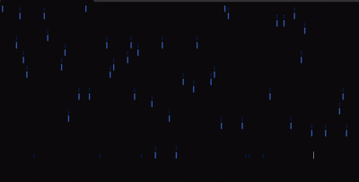

# Digital Rain Animation: Bringing the Matrix to Your Terminal



## Project Overview

The animation displays cascading blue characters that fall from the top of your terminal to the bottom, mimicking the iconic computer code visualization from the Matrix films. When characters reach the bottom, they wrap around to the top again, creating a mesmerizing continuous rain effect that can run indefinitely.

### Key Features

- **Pure C++ Implementation**: No external dependencies beyond the standard library
- **Terminal-based**: Works in any command-line environment
- **Customizable**: Adjustable speed and display styles
- **Memory Efficient**: Minimal resource usage even for long-running sessions

## Technical Deep Dive

### Architecture

The project follows object-oriented design principles with a clean separation of concerns:

```
├── DigitalRain.h       # Class declarations and interface
├── DigitalRain.cpp     # Implementation details
└── main.cpp            # Program entry point and configuration
```

### Core Components

#### The DigitalRain Class

This is the heart of the project, encapsulating all the logic required for the animation:

```cpp
class DigitalRain {
public:
    DigitalRain(int width, int height);
    void setSpeed(Speed spd);
    void setMode(Mode md);
    void run();
private:
    int width;   // Number of columns
    int height;  // Number of rows
    Speed speed; // Simulation speed 
    Mode mode;   // Display mode
    std::vector<int> columnPositions;
    
    void update();
    void render();
    int getDelayMilliseconds() const;
    void clearScreen() const;
};
```

The class maintains the state of each "rain drop" in the `columnPositions` vector, with one position per column. This elegant approach means we only need to track the head position of each drop, making the implementation memory-efficient regardless of screen size.

#### Enums for Configuration

Using enums provides type safety and clear intent for configuration options:

```cpp
enum class Speed { Medium };
enum class Mode { Alternate };
```

This approach is easily extensible—adding more speeds or display modes would only require adding more enum values and implementing the corresponding behavior.

### Animation Techniques

#### The Main Loop

The animation runs in a simple but effective game loop pattern:

```cpp
void DigitalRain::run() {
    while (true) {
        render();
        update();
        std::this_thread::sleep_for(std::chrono::milliseconds(getDelayMilliseconds()));
    }
}
```

This follows the classic "render, update, wait" pattern used in many graphics applications and games.

#### Terminal Control with ANSI Escape Sequences

One of the most interesting aspects is how the program manipulates the terminal display. Instead of using a library like ncurses, it directly employs ANSI escape sequences:

```cpp
void DigitalRain::clearScreen() const {
    // \033 is the ESC character in octal
    // [2J clears the entire screen
    // [H moves cursor to home position
    std::cout << "\033[2J\033[H";
}
```

For character coloring:

```cpp
// Blue "head" character
std::cout << "\033[94m" << ch << "\033[0m";

// Darker "tail" character
std::cout << "\033[34m" << ch << "\033[0m";
```

#### Randomization and Wrapping

The rain effect uses randomization for initial positions:

```cpp
columnPositions[i] = std::rand() % height;
```

And wrapping arithmetic to create the continuous fall effect:

```cpp
columnPositions[i] = (columnPositions[i] + 1) % height;
```

This elegant modulo operation ensures drops that reach the bottom seamlessly reappear at the top.

## Performance Considerations

The implementation is remarkably efficient:

1. **Minimal Memory Usage**: Only stores the head position for each column
2. **Efficient Screen Updates**: Only redraws what's necessary
3. **Controlled Timing**: Uses precise sleep durations to maintain consistent animation

## Themes and Visual Design Options

The current implementation focuses on the classic blue Matrix rain, but there are several visual themes and design options that could be implemented with minimal changes to the codebase:

### Color Themes

1. **Classic Green Matrix**: The iconic green shade from the original film
   ```cpp
   // Head character in bright green
   std::cout << "\033[92m" << ch << "\033[0m";
   // Tail character in darker green
   std::cout << "\033[32m" << ch << "\033[0m";
   ```

2. **Cyberpunk Purple**: A modern cyberpunk aesthetic
   ```cpp
   // Head character in bright purple
   std::cout << "\033[95m" << ch << "\033[0m";
   // Tail character in darker purple
   std::cout << "\033[35m" << ch << "\033[0m";
   ```

3. **Hacker Terminal**: A monochrome white-on-black theme
   ```cpp
   // Head character in bright white
   std::cout << "\033[97m" << ch << "\033[0m";
   // Tail character in gray
   std::cout << "\033[90m" << ch << "\033[0m";
   ```

4. **Rainbow Mode**: Implementing a color cycle based on row position
   ```cpp
   // Example of how to implement color cycling
   int colorCode = 31 + (row % 6); // Cycles through colors 31-36
   std::cout << "\033[" << colorCode << "m" << ch << "\033[0m";
   ```

### Character Sets

Currently, the animation uses basic ASCII characters (`|` and `:`), but could be extended to include:

1. **Matrix-Style Katakana**: More authentic to the film
   ```cpp
   // Array of Matrix-like characters
   const char matrixChars[] = "ﾊﾐﾋｰｳｼﾅﾓﾆｻﾜﾂｵﾘｱﾎﾃﾏｹﾒｴｶｷﾑﾕﾗｾﾈｽﾀﾇﾍ";
   // Select a random character
   char ch = matrixChars[rand() % (sizeof(matrixChars) - 1)];
   ```

2. **Binary**: A simple 0 and 1 pattern
   ```cpp
   char ch = (rand() % 2) ? '1' : '0';
   ```

3. **ASCII Art**: Using extended ASCII characters for more complex visuals
   ```cpp
   const char asciiChars[] = "╔╗╚╝║═╠╣╦╩╬┌┐└┘│─├┤┬┴┼";
   char ch = asciiChars[rand() % (sizeof(asciiChars) - 1)];
   ```

### Animation Patterns

1. **Density Control**: Vary the density of rain drops
   ```cpp
   // Only spawn a drop with certain probability
   if (rand() % 100 < densityPercentage) {
       // Create a new drop
   }
   ```

2. **Gravity Effects**: Implement acceleration for more natural movement
   ```cpp
   // Simplified example - drops accelerate as they fall
   columnSpeeds[i] += 0.1f;
   columnPositions[i] += columnSpeeds[i];
   ```

3. **Wave Patterns**: Synchronize columns to create wave-like effects
   ```cpp
   // Create sin wave pattern across columns
   float offset = sin(col * 0.1) * 5.0f;
   int adjustedRow = (row + static_cast<int>(offset)) % height;
   ```

## Future Enhancements

While the current implementation already looks great, here are some potential extensions:

1. **Variable Drop Speeds**: Allow different columns to fall at different rates
2. **Character Variety**: Randomize the characters used for a more authentic Matrix look
3. **Color Variations**: Add more color transitions or intensity changes
4. **User Interaction**: Allow keyboard input to change modes in real-time
5. **Multi-threading**: Utilize multiple cores for even smoother animation on large terminals
6. **Config File**: Add a configuration file to allow customization without recompilation
7. **Terminal Size Detection**: Automatically detect and adapt to the terminal size

## Running the Project

To compile and run the project:

```bash
g++ -std=c++17 main.cpp DigitalRain.cpp -o digital_rain
./digital_rain
```

Press Ctrl+C to exit when you're done being mesmerized!

## Technical Implementation Details

### ANSI Escape Sequence Explained

The animation relies heavily on ANSI escape sequences, which might be unfamiliar to some developers. These sequences are special character combinations that control terminal behavior:

- **`\033`**: The escape character (octal notation)
- **`[2J`**: Clear the entire screen
- **`[H`**: Move cursor to home position (top-left)
- **`[<n>m`**: Set display attributes, where `<n>` is the color/style code:
  - `30-37`: Set text color (black, red, green, yellow, blue, magenta, cyan, white)
  - `90-97`: Set bright text color
  - `0`: Reset all attributes

For developers unfamiliar with terminal control, here's a basic breakdown of how the screen refreshing works:

1. Clear the entire screen with `\033[2J\033[H`
2. Rebuild the entire display by iterating through each position
3. Use color codes to create the visual effect of "heads" and "tails"
4. Sleep for a short duration to control animation speed
5. Repeat the process

### Optimization Techniques

The current implementation uses several optimization techniques worth noting:

1. **Single-pass rendering**: Each frame is drawn in a single pass through the grid
2. **Minimal state**: Only tracking head positions reduces memory usage
3. **Row-first iteration**: Matches the natural output flow of terminal text
4. **Modulo arithmetic**: Efficient wrapping behavior without conditionals

## About the Author

This project was created by Emeka Adimora, a 4th year Software and Electronic Engineering student at ATU Galway. This implementation demonstrates the application of object-oriented programming principles and terminal manipulation techniques learned throughout the software engineering curriculum.

## References

[1] Wachowski, L., & Wachowski, L. (1999). The Matrix. Warner Bros.

[2] Gamma, E., Helm, R., Johnson, R., & Vlissides, J. (1994). Design Patterns: Elements of Reusable Object-Oriented Software. Addison-Wesley.

[3] Standards Council of the IEEE Computer Society. (2017). ISO/IEC 14882:2017 Programming Language C++. International Organization for Standardization.
